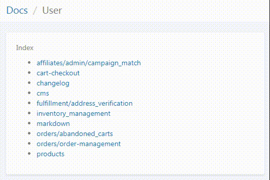

# yii2-docs-module

Advanced documentation viewer for Markdown or TXT files:

* automatically injects list of pages to index of each folder
* supports multiple languages
* callbacks for custom UI, breadcrumbs etc.



### Installation via Composer

You can install package with a command:

> composer require webkadabra/yii2-docs-module

### Example usage with Yii2 Advanced App

Assume the following structure of your applicaiton's folders:

```

  /backend
  /docs
    /user
      /orders
        /fulfillment.md
  /frontend  
```

Where `fulfillment.md` is your user documentaiton for (example) "Fulfillment operations". 
Anyways, add this module to your `backend` config first:

```
// ...
'modules' => [
        // ...
        'docs' => [
            'class' => 'webkadabra\yii\modules\docs\Module',  
        ],
        // ...
],
// ...
```

Advanced configuration example (e.g. add breadcrumbs):

```
// ...
'modules' => [
        // ...
        'docs' => [
            'class' => 'webkadabra\yii\modules\docs\Module',
            'layout' => '/docs',
            'on beforeAction' => function ($event) {
                /** @var yii\base\ActionEvent $event */
                Yii::$app->view->params['breadcrumbs'][] = [
                    'label' => Yii::t('app', ucfirst($event->sender->id)),
                    'url' => ['docs/docs/index'],
                ];
                $exs = explode('/', Yii::$app->request->getQueryParam('page'));
                $current = array_pop($exs);
                $path = [];
                foreach ($exs as $ex) {
                    $path[] = $ex;
                    Yii::$app->view->params['breadcrumbs'][] = [
                        'label' => ucwords(str_replace(['/', '_'], ['/', ' '], $ex)),
                        'url' => rawurldecode(\common\helpers\Url::toRoute(
                            [
                                'docs/docs/index',
                                'page' => implode('/', $path),
                            ]
                        )), 
                    ];
                }
                Yii::$app->view->params['breadcrumbs'][] = ucwords(str_replace(
                    ['/', '_'],
                    ['/', ' '],
                    $current
                ));
            },
        ],
        // ...
],
// ...
```

Add custom rule in `urlManager` component:

```
// ...
'components' => [
  // ...
    'urlManager' => [
      'rules' => [
        'docs/<page:[\w\d\/_-]*>' => 'docs/docs/index',
      ],
    ],
  ],
```

Now you have your documentaiton available at `http://backend.website.test/docs/user/orders/fulfillment`, and going up a tree structure would bring index of documents in that directory, e.g.: `http://backend.website.test/docs/user/` will bring list of documents in 'docs/user` directory (recursively). 

## TODO

* [x] Multilanguage support
* [ ] Unit tests

Thanks, pull requests are welcome!

- Sergii
